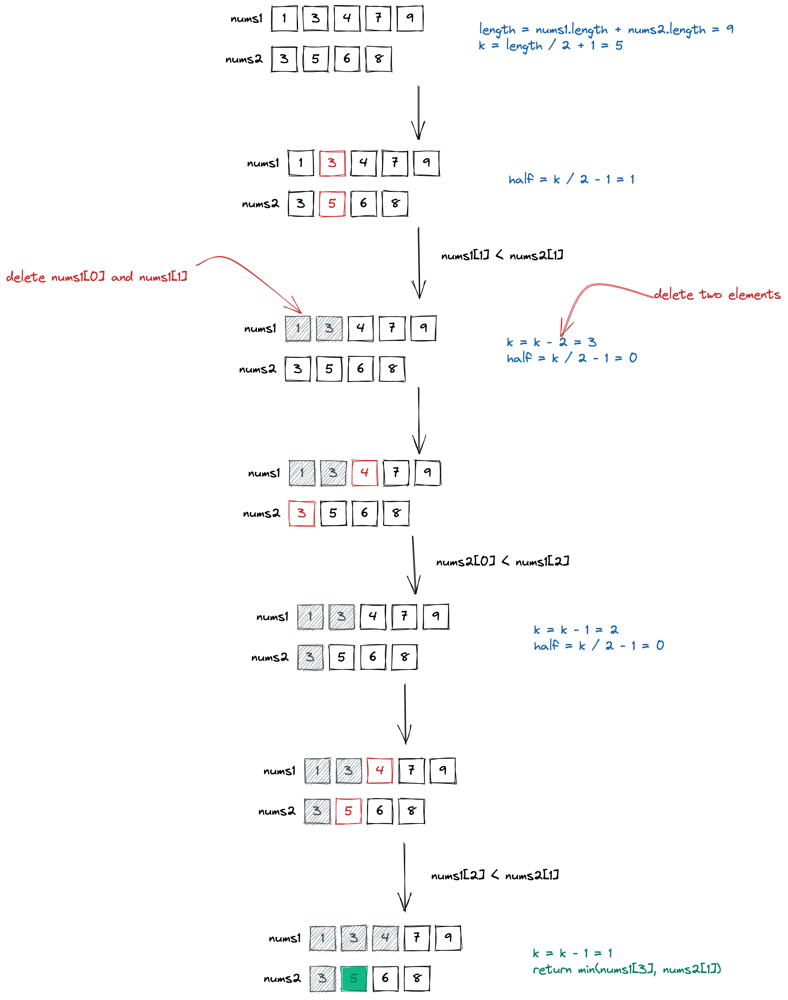

= Median Of Two Sorted Arrays
:toc: left
:icons: font
Curry Cooky <currycooky@qq.com>
1.0, 2022-09-02

== Overview
____
来源：力扣（LeetCode）
链接：https://leetcode.cn/problems/median-of-two-sorted-arrays
著作权归领扣网络所有。商业转载请联系官方授权，非商业转载请注明出处。
____
给定两个大小分别为 m 和 n 的正序（从小到大）数组 nums1 和 nums2。请你找出并返回这两个正序数组的 中位数 。

算法的时间复杂度应该为 O(log (m+n)) 。

== Solution

== Code
[source, java]
----
class Solution {
    public double findMedianSortedArrays(int[] nums1, int[] nums2) {
        int length = nums1.length + nums2.length;
        if (length % 2 == 0) {
            int mid1 = length / 2;
            int mid2 = mid1 - 1;
            return (getKth(nums1, nums2, mid1 + 1) + getKth(nums1, nums2, mid2 + 1)) / 2D;
        } else {
            return getKth(nums1, nums2, length / 2 + 1);
        }
    }

    public int getKth(int[] nums1, int[] nums2, int k) {
        int length1 = nums1.length, length2 = nums2.length;
        int i1 = 0, i2 = 0;
        while (true) {
            if (i1 == length1) {
                return nums2[i2 + k - 1];
            }
            if (i2 == length2) {
                return nums1[i1 + k - 1];
            }
            if (k == 1) {
                return Math.min(nums1[i1], nums2[i2]);
            }
            int half = k / 2;
            int newIndex1 = Math.min(i1 + half, length1) - 1;
            int newIndex2 = Math.min(i2 + half, length2) - 1;
            if (nums1[newIndex1] <= nums2[newIndex2]) {
                k -= (newIndex1 - i1 + 1);
                i1 = newIndex1 + 1;
            } else {
                k -= (newIndex2 - i2 + 1);
                i2 = newIndex2 + 1;
            }
        }
    }
}
----