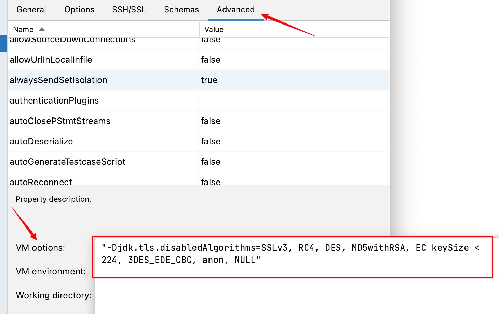

# 问题记录

## The server selected protocol version TLS10 is not accepted by client preferences [TLS13, TLS12]
> DataGrip 2022.2.4

在连接Sql Server数据库时提示这个异常，并且，在连接MySQL时会提示：
```
Communications link failure
The last packet sent successfully to the server was 0 milliseconds ago. The driver has not received any packets from the...
```

这两个问题都是属于同一个问题，因为客户端没有允许使用`TLS`系列安全算法，所以我们只需要在软件中允许他们就可以。

```
"-Djdk.tls.disabledAlgorithms=SSLv3, RC4, DES, MD5withRSA, EC keySize < 224, 3DES_EDE_CBC, anon, NULL"
```

